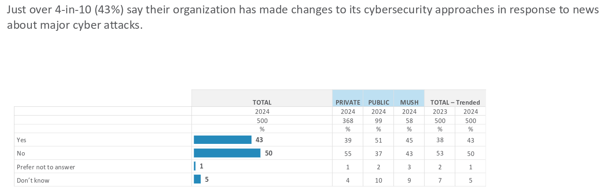
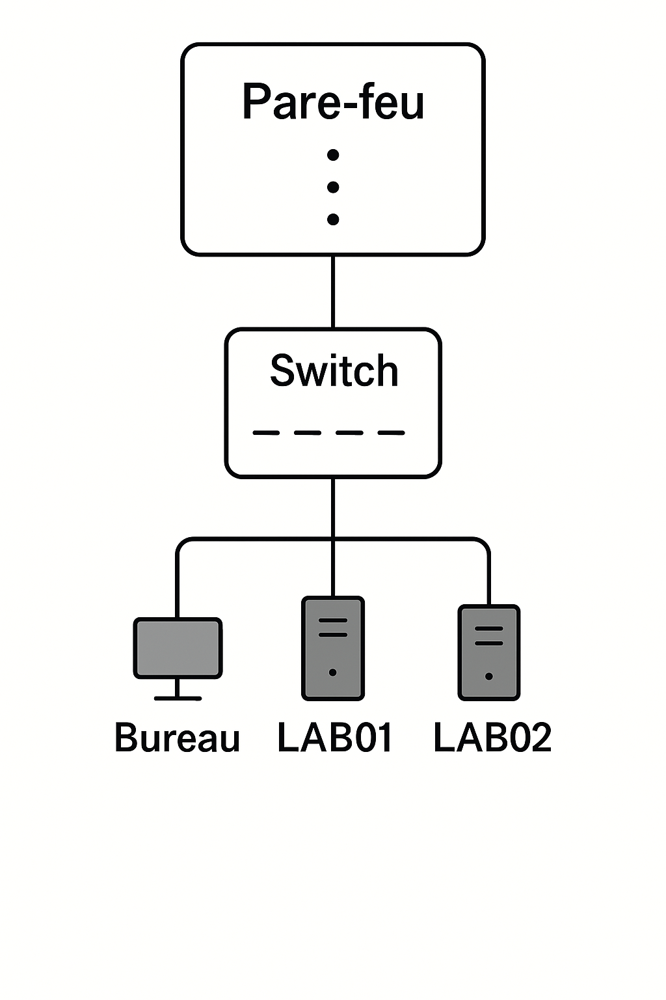
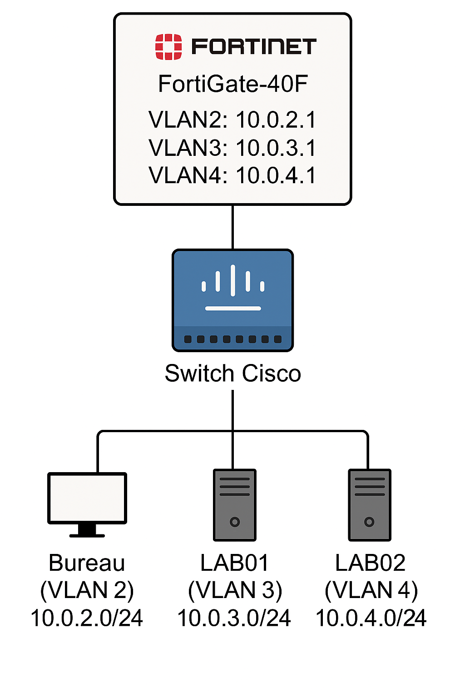

# Veille technologique - Implémentation d'une infrastructure réseau

#### 420-1SH-SW
#### 13 Juin 2025
#### Par Ariane Courcy
#### Remise à M.Nicolas Bourré

## Table des matières

- [Introduction](#introduction)
- [Explication du projet](#explication-du-projet)
    - [Objectif](#objectif)
    - [Planification](#planification)
- [Explication des fonctionnalités](#explication-des-fonctionnalites)
    - [Choix des technologies](#choix-des-technologies)
    - [Implémentation](#implementation)
    - [Autres technologies](#autres-technologies)
- [Conclusion](#conclusion)
- [Médiagraphie](#mediagraphie)

## Introduction 

Dans un monde où les cyberattaques sont de plus en plus fréquentes, la cybersécurité est devenue une priorité absolue pour les entreprises et organisations. Selon une enquête menée, en 2024, par l'Autorité canadienne pour les enregistrements Internet (CIRA) on dit que 43% des gestionnaires en cybersécurité ont changé leur façon de répondre aux cyberattaques de grande envergure[^1].

Cette enquête met en lumière l'importance des mesures de sécurité robustes pour protéger le réseau et les données. L'un des éléments clés de ces mesures est la mise en place d'un pare-feu, qui est un système de sécurité qui contrôle le trafic réseau. La segmentation réseau, qui consiste à diviser un réseau en segments isolés, est aussi essentielle pour limiter la propagation des attaques. La combinaison de ces deux mesures renforce la sécurité et les actifs numériques des organisations.

> Sur un plan personnel, j'ai choisi ce projet pour sa capacité à effectuer des tests sur le long terme. En effet, il est essentiel d'avoir une bonne structure réseau pour protéger l'établissement. Mon objectif est donc de créer une infrastructure réseau simplifiée et efficace, capable de répondre aux besoins de l'établissement et de garantir la sécurité des données. Je souhaite ainsi évaluer les performances et la sécurité de cette infrastructure et identifier les domaines d'amélioration. Aussi, j'aurais aimé pousser plus loin lors du cours de réseau, donc j'en ai l'occasion ici.

## Explication du projet 

**<ins>Objectif</ins>** 

L'objectif de ce projet est de mettre en place une infrastructure réseau simple pour expérimenter. Pour y parvenir, nous utiliserons un pare-feu qui offre une sécurité avancée et une gestion du trafic réseau efficace, et une switch configurable qui est connue pour sa fiabilité et sa facilité de configuration. Nous allons avoir une connectivité Internet sur le pare-feu, puis nous allons mettre en place une segmentation réseau de base pour isoler les différents segments de réseau. 

**<ins>Planification</ins>** 

La configuration du pare-feu impliquera la définition des paramètres de connexion WAN et la configuration des interfaces réseau. Ensuite, nous configurerons la switch pour connecter les différents segments de réseau et définir les paramètres de commutation. La dernière étape sera d'ajouter les règles sur le pare-feu pour segmenter les différents segments de réseau. À la fin de ce projet, nous aurons mis en place une infrastructure réseau simple et sécurisée qui nous permettra de tester et d'évaluer les performances de nos équipements et de nos configurations réseau, et de garantir la sécurité et la fiabilité de nos réseaux informatiques.

Notre infrastructure réseau comportera un pare-feu qui sera connecté à une switch pour étendre les réseaux virtuels (vlans) et garantir la sécurité des communications. Les vlans seront configurés pour séparer les différents locaux, la switch sera utilisée pour tester la communication entre les interfaces. Nous aurons trois interfaces réseau : un bureau qui servira d'interface de gestion, une pour le laboratoire un et une pour le laboratoire deux. Ces interfaces seront configurées pour recréer l'infrastructure du département d'informatique et garantir la sécurité et la fiabilité des communications[^2].

## Explication des fonctionnalités 

**<ins>Choix des technologies</ins>** 

Notre infrastructure réseau sera équipée d'un pare-feu Fortigate-40F, qui offre une sécurité réseau robuste et une grande flexibilité de configuration. Nous avons choisi ce modèle pour sa disponibilité et son adaptabilité aux besoins de petites entreprises, qui nécessitent une sécurité réseau efficace sans les coûts et la complexité associés aux solutions plus grandes. Nous n'aurons malheureusement pas les ressources et le temps de tout configurer dans ce projet.

Notre infrastructure réseau sera également équipée d'une switch Cisco 8 ports, qui offre une grande flexibilité et une facilité de configuration. Nous avons choisi ce modèle pour sa simplicité de mise en œuvre et sa capacité à gérer les communications entre les différents équipements de notre réseau. De plus, sa facilité de configuration nous permettra de mettre en place rapidement et facilement les paramêtres de gestion de réseau nécessaires pour protéger notre infrastructure.

Au lieu de utiliser des zones de sécurité sur le Fortigate, nous avons choisi de configurer des VLANs (Virtual Local Area Networks) pour séparer les différents réseaux et améliorer la sécurité de notre infrastructure. Les VLANs nous permettent de créer des réseaux virtuels isolés les uns des autres, ce qui réduit les risques de propagation des attaques et des menaces. De plus, la configuration des VLANs est plus simple et plus intuitive que la configuration des zones, ce qui nous permet de gérer plus facilement les paramètres de sécurité et de réseau.

Notre infrastructure réseau comportera trois VLAN : un pour le bureau et deux pour les laboratoires[^3].

- VLAN2: Bureau - 10.0.2.0/24
- VLAN3: LAB01 - 10.0.3.0/24
- VLAN4: LAB02 - 10.0.4.0/24

Le bureau sera en mesure de surveiller et de gérer les laboratoires, mais les laboratoires seront isolés les uns des autres et ne pourront pas se voir. De même, les laboratoires ne pourront pas accéder au bureau, ce qui permettra de maintenir une séparation stricte entre les différents environnements de travail.

**<ins>Implémentation</ins>** 

Pour toute l'implémentation, la documentation existante était incomplète, ce qui a nécessité une exploration approfondie pour comprendre les configurations requises. Une exploration a donc été menée pour combler les lacunes de la documentation et découvrir les meilleures pratiques pour l'infrastructure. Cette exploration a permis de créer des documentations détaillées et précises pour les futures configurations, ce qui facilitera la mise en œuvre et la gestion de l'infrastructure.

Voici une liste des documentations qui ont été créées:

- [Activation du WAN](./documentations/wan.md)
- [Création d'un VLAN](./documentations/vlan.md)
- [Configuration de la switch Cisco](./documentations/cisco_config.md)
- [Implémentation des règles de pare-feu](./documentations/policies.md)

Malgré tout, les documentations officielles ont été explorées pour faciliter la compréhension de l'environnement[^4] [^5].

**<ins>Autres technologies</ins>** 

## Conclusion 

## Médiagraphie 

[^1]: CIRA. (2024). CIRA 2024 Cybersecurity Report. Récupéré de https://www.cira.ca/uploads/2024/09/CIRA-2024-Cybersecurity-Report.pdf, Consulté le 8 juin 2025

[^2]: Microsoft, Prompt: https://copilot.microsoft.com/shares/4TRTwPKWooDKMSSNtdHiA, Copilot, Version Web (aucune version précise), https://copilot.microsoft.com/, Généré le 12 juin 2025

[^3]: OpenAI, Prompt: https://chatgpt.com/share/68487cf6-bfc0-8008-b970-63f259c72cd0, ChatGPT, Version GPT-4o mini, https://chatgpt.com/, Généré le 10 juin 2025

[^4]: Fortinet. (2022). FortiGate Administration Guide (Chapitre 5 : Configuration du pare-feu), Récupéré de https://docs.fortinet.com/, Consulté le 26 mai 2025

[^5]: Cisco Systems, Inc. (2022). CCNA Routing and Switching. Récupéré de https://www.netacad.com/, Généré le 26 mai 2025