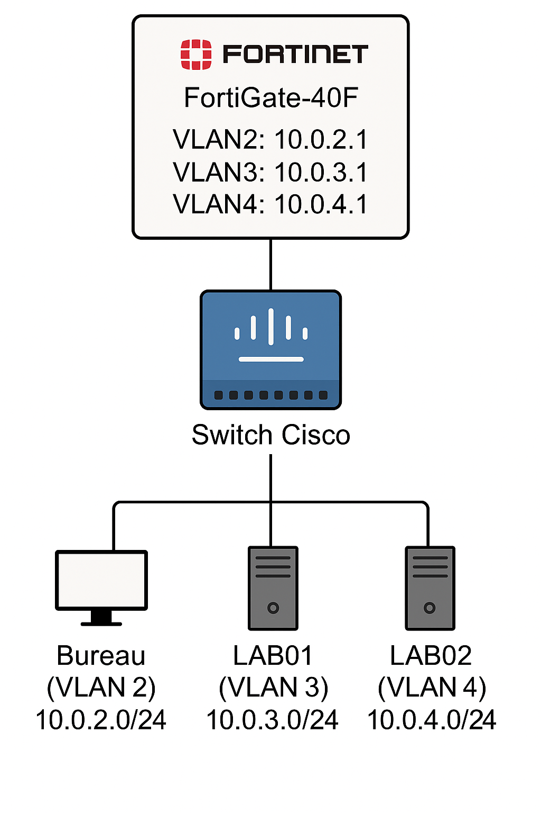

# Veille technologique - Implémentation d'une infrastructure réseau

#### 420-1SH-SW
#### 13 Juin 2025
#### Par Ariane Courcy
#### Remise à M.Nicolas Bourré

## TABLE DES MATIERES
A COMPLETER

## Introduction

Dans un monde où les cyberattaques sont de plus en plus fréquentes et poussées, la cybersécurité est devenue une priorité absolue pour les entreprises et organisations. Selon une enquête menée, en 2024, par l'Autorité canadienne pour les enregistrements Internet (CIRA). Dans cette enquête, on dit que 43% des gestionnaires en cybersécurité ont changé leur façon de répondre aux cyberattaques de grande envergure[^1].

Cette enquête a mis en lumière l'importance des mesures de sécurité robustes pour protéger le réseau et les données. L'un des éléments clés de ces mesures est la mise en place d'un pare-feu, qui est un système de sécurité qui contrôle le trafic réseau. La segmentation réseau, qui consiste à diviser un réseau en segments isolés, est aussi essentielle pour limiter la propagation des attaques. La combinaison de ces deux mesures renforce la sécurité et les actifs numériques des organisations.

## Explication du projet

L'objectif de ce projet est de mettre en place une telle infrastructure réseau simple pour des tests et évaluations. Pour y parvenir, nous utiliserons un pare-feu Fortigate-40F qui offre une sécurité avancée et une gestion du trafic réseau efficace, et une switch Cisco qui est connue pour sa fiabilité et sa facilité de configuration. Nous allons activer le WAN sur le pare-feu pour avoir une connexion à Internet, puis nous allons mettre en place une segmentation réseau standard pour isoler les différents segments de réseau. 

La configuration du pare-feu impliquera la définition des paramètres de connexion WAN et la configuration des interfaces réseau. Ensuite, nous configurerons la switch Cisco pour connecter les différents segments de réseau et définir les paramètres de commutation. La dernière étape sera d'ajouter les règles sur le pare-feu pour segmenter les différents segments de réseau. À la fin de ce projet, nous aurons mis en place une infrastructure réseau simple et sécurisée qui nous permettra de tester et d'évaluer les performances de nos équipements et de nos configurations réseau, et de garantir la sécurité et la fiabilité de nos réseaux informatiques.

Notre infrastructure réseau comportera trois VLAN : un pour le bureau et deux pour les laboratoires[^2].

- VLAN2: Bureau - 10.0.2.0/24
- VLAN3: LAB01 - 10.0.3.0/24
- VLAN4: LAB02 - 10.0.4.0/24

Le bureau sera en mesure de surveiller et de gérer les laboratoires, mais les laboratoires seront isolés les uns des autres et ne pourront pas se voir. De même, les laboratoires ne pourront pas accéder au bureau, ce qui permettra de maintenir une séparation stricte entre les différents environnements de travail.

## Explication des fonctionnalités

## Conclusion

## Médiagraphie

[^1]: CIRA. (2024). CIRA 2024 Cybersecurity Report. Récupéré de https://www.cira.ca/uploads/2024/09/CIRA-2024-Cybersecurity-Report.pdf, Consulté le 8 juin 2025

[^2]: OpenAI, Prompt: https://chatgpt.com/share/68487cf6-bfc0-8008-b970-63f259c72cd0, ChatGPT,Version GPT-4o mini, https://chatgpt.com/, Généré le 10 juin 2025

- https://docs.fortinet.com/
- https://www.netacad.com/ (Documentation et formations Cisco)
- https://www.pensezcybersecurite.gc.ca/fr/sont-organisations-canadiennes-matiere-cybersecurite-2024