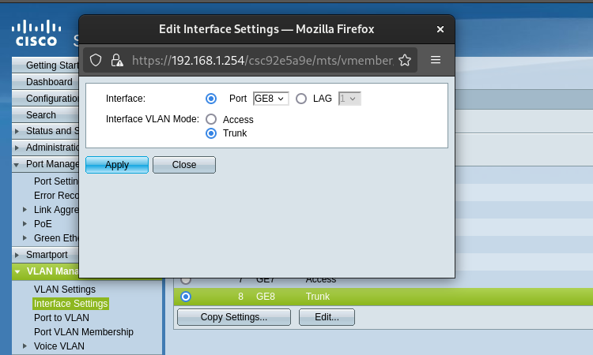
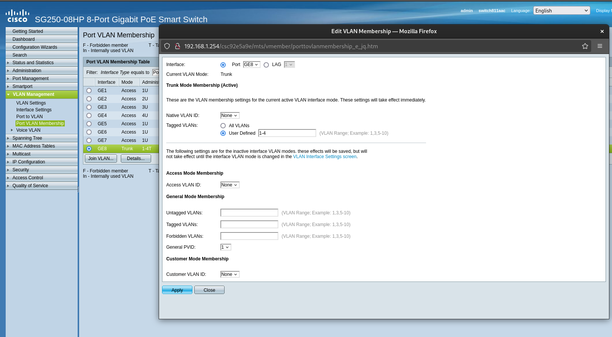
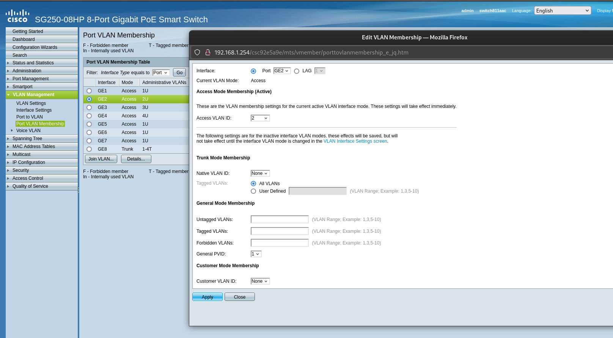

# Configuration de la switch Cisco

Pour que le pare-feu gère le traffic qui passe à travers de la switch Cisco, il faut la configurer en fonction.

Il faut mettre une prise en mode *tagged* et *trunk* qui sera connecter au lan du pare-feu. 

Ensuite dans ce port, il faut ajouter les vlans qui arrivent du pare-feu.

Il faut ajouter les vlans que l'on veut sur chaque prise. Par exemple, le vlan 2 dans la prise 2.

Après ces configurations, lorsque l'on branche un poste dans une prise, l'adresse du poste sera donnée par le pare-feu dans la bonne plage réseau.