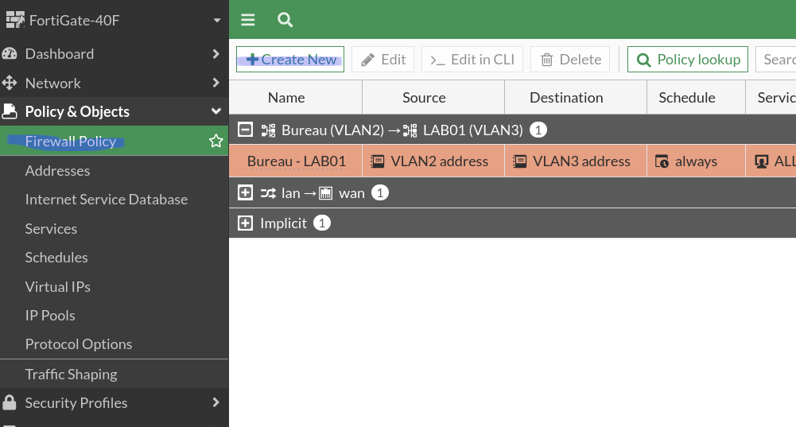
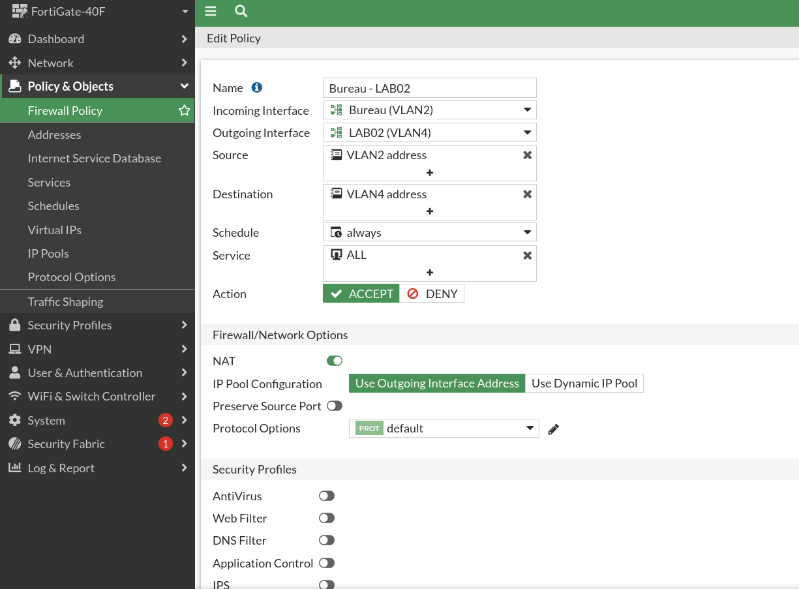

# Implémentation des règles de pare-feu

Pour finaliser la segmentation réseau, il faut rajouter des règles qui gère le trafic entre les vlans.

Ici, nous voulons que le vlan du bureau voit celui du laboratoire 2.

Grâce à cette règle, mon bureau a accès aux deux laboratoires sans que les laboratoires ayent accès au bureau.