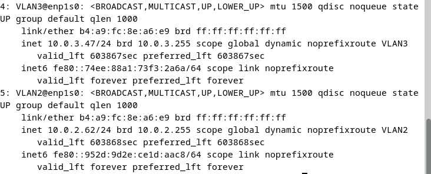

# Création d'un vlan

Pour segmenter un réseau, il est nécessaire de créer des VLAN (Virtual Local Area Network), qui sont des sous-réseaux logiques de réseaux physiques. Voici les étapes pour créer un VLAN sur le pare-feu :

Tout d'abord, il faut accéder à la configuration du VLAN sur le pare-feu, comme indiqué sur la figure suivante :

Ensuite, il faut choisir la plage réseau que l'on désire attribuer au VLAN. Dans cet exemple, nous allons utiliser la plage 10.0.5.0/24, comme indiqué sur la figure suivante :

Il est également important d'activer le serveur DHCP (Dynamic Host Configuration Protocol) pour que le VLAN puisse distribuer automatiquement des adresses IP aux appareils qui s'y connectent. Cela peut être fait en suivant les étapes indiquées sur la figure suivante :

Pour tester la configuration du VLAN, nous pouvons configurer des interfaces réseaux virtuelles sur un ordinateur portable et vérifier si le VLAN nous propose des adresses IP valides. Cela nous permet de vérifier que la configuration du VLAN est correcte et que les appareils peuvent se connecter au réseau sans problème.

