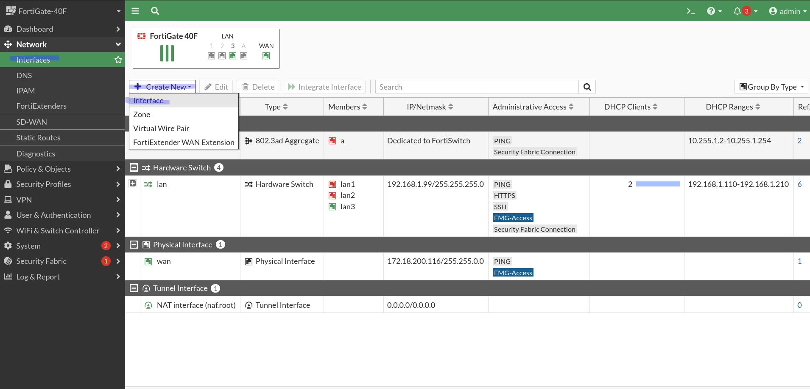
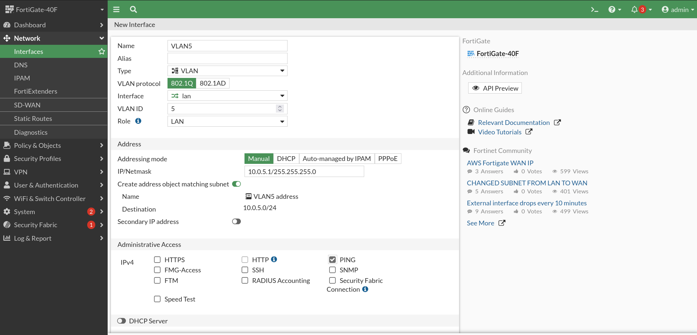
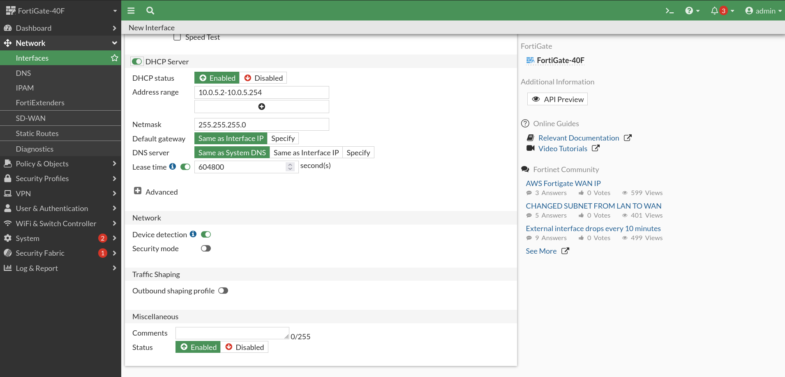

# Création d'un vlan

Pour segmenter un réseau, on doit créer des vlans. Les vlans sont des sous-réseaux logiques de réseaux physiques. Voici les étapes pour créer un vlan sur le pare-feu.

Dans la configuration du vlan, on doit choisir la plage réseau que l'on désire. Ici, 10.0.5.0/24

Il faut aussi activé le DHCP server pour que le vlan distribue automatiquement une adresse ip.

