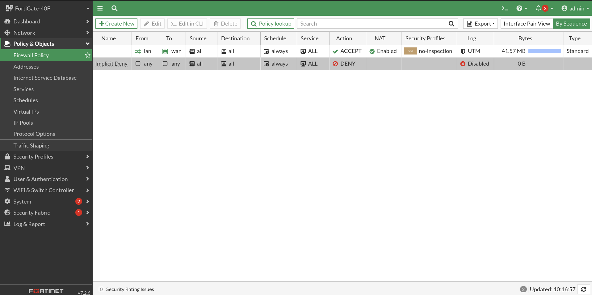

# Activation du WAN

Par défaut, lorsque le Fortigate est configuré pour la première fois, le port WAN est activé, permettant ainsi de se connecter à Internet ou à un réseau étendu. Pour accéder au WAN, il suffit de brancher un câble du port WAN du Fortigate à un routeur ou à un modem.

Une politique de sécurité est également active par défaut pour le fonctionnement du WAN, ce qui signifie que le Fortigate applique des règles de sécurité pour contrôler le trafic réseau entre le LAN et le WAN. Cette politique de sécurité par défaut permet de protéger le réseau local contre les attaques et les menaces provenant de l'extérieur, tout en autorisant les communications légitimes entre le LAN et le WAN.

Il est important de noter que cette configuration de base et la politique de sécurité par défaut peuvent être personnalisées et modifiées pour répondre aux besoins spécifiques de l'organisation et de son infrastructure réseau.

